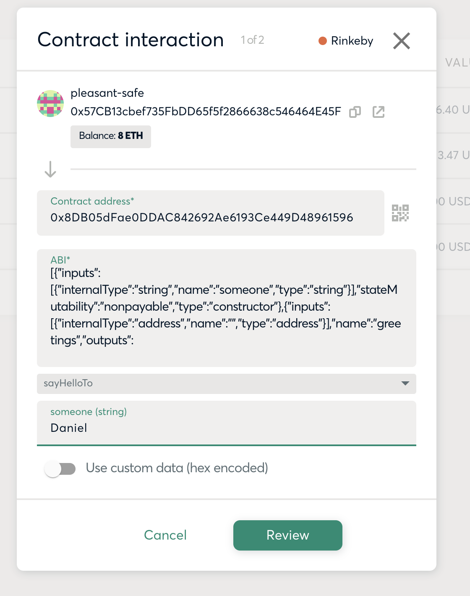

# Say Hello in Solidity

A simple example of say hello in Solidity.

```solidity
    mapping(address => string) public greetings;
```

greeting format stored: `0x680cde08860141f9d223ce4e620b10cd6741037e says hello to Dani!!!`


## Environment variables

Create a `.env` file using `example.env` as a template

## scripts

### Install dependencies

```
npm install
```

### Deploy SayHello Smart Contract

```
npm run deploy
```

### Check the state of the Smart Contract

```
npx hardhat getGreetings --account 0x680cde08860141F9D223cE4E620B10Cd6741037E
```

### Interact with the Smart Contract using hardhat task

```
npx hardhat sayHelloTo --someone Dani
```

## Usage

After the deployment, you can call the `sayHelloTo` method, with a `someone` string parameter:

```
0x57cb13cbef735fbdd65f5f2866638c546464e45f says hello to Daniel!!!
```


